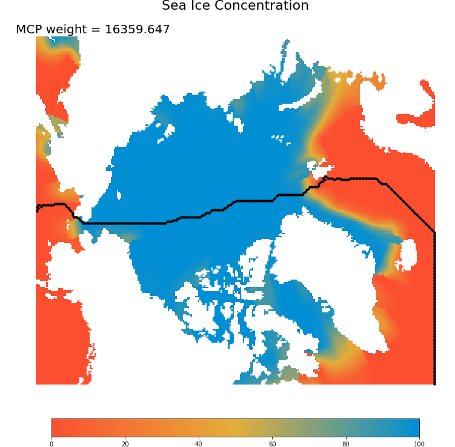
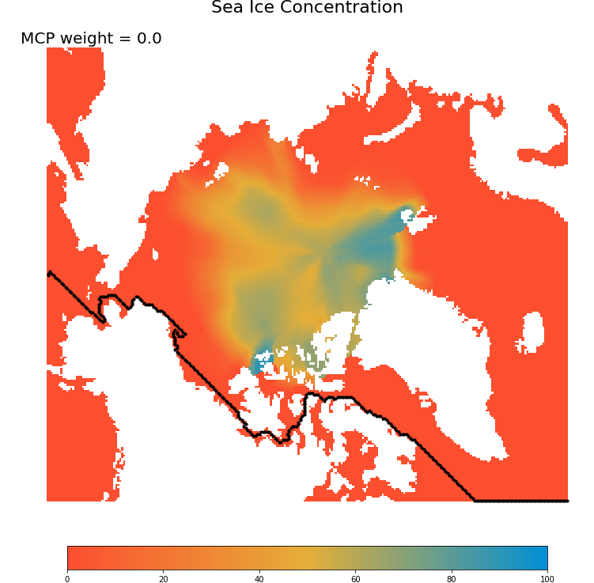
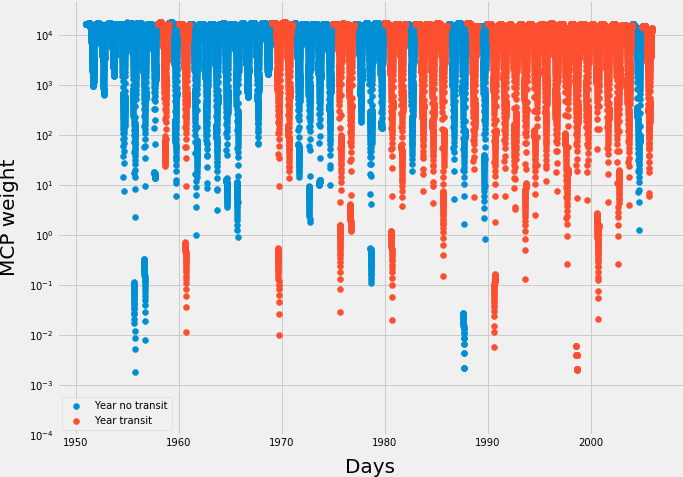
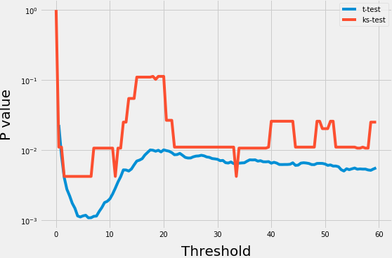
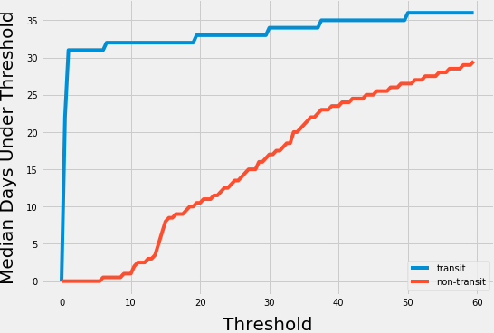
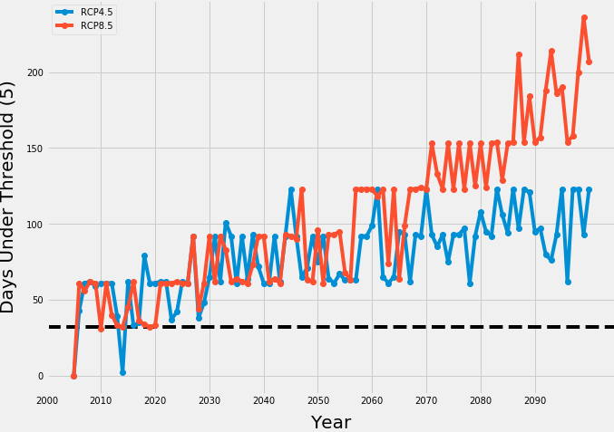

# North by Northwest
Forecasting transit through the Northwest Passage.

## Arctic Sea Ice Projections

The Canadian Centre for Climate Modelling and Analysis has [climate projections](http://climate-modelling.canada.ca/climatemodeldata/canrcm/CanRCM4/index.shtml) for the Arctic at small grid resolutions (about 25km). There are two projections under different greenhouse scenarios (RCP4.5 and RCP8.5) that extend to the year 2100, plus historical data. I use the daily sea ice concentration (sic) datasets to predict transit through the Northwest Passage.  

## Minimum Cost Path (MCP)

For any given day, I map the sea ice concentration and mask out the land. I calculate the Minimum Cost Path ([MCP](http://scikit-image.org/docs/dev/api/skimage.graph.html)) to find the shortest nautical route through the Bering Straight to the Labrador Sea. The weight of the MCP is, in essence, the sum of the sea ice concentrations at each grid along the route, but considering diaganol moves slightly differently (geometric MCP). These MCP weights are used to estimate transit through the Northwest Passage.

Frozen passage            |  Open passage
:-------------------------:|:-------------------------:
  |  

## Historical Analysis

The historical sea ice concentration data and the [record](http://www.nauticapedia.ca/Articles/NWP_Fulltransits.php) of successful Northwest Passage transits are used to turn the MCP weights into interpretable values. There is likely a difference in MCP weights between years of successful transit and non-transit --- I just need to find it. I omit any transit by icebreaker vessels to emphasize years with somewhat *easier* travel. 

My first hunch is that transit years have more days with weights below some threshold than non-transit years. 

### Days with Weights Below Threshold

I calculate the MCP weights every day between 1951 and 2005. For each year, I get the percentage of days with MCP weights below a threshold. I statistically compare the days below the threshold between transit and non-transit years with both a t-test and a Kolmogorov Smirnov test, just to be safe with this little (percentage) dataset. 

Stats Test             |  Median Comparison
:-------------------------:|:-------------------------:
  |  

There are apparent statistical differences between transit and non-transit years when the threshold is between 1 and 10. In this range, there are clear differences in median days below the thresholds between transit and non-transit years. Generally, at a threshold of 5, transit years have about 32 days below the threshold, whereas non-transit years have no days below the threshold. So I assume transit is possible if there are more than 32 days with MCP weights below a threshold of 5 in a year.

## Forecasting

After about 2030, every year will have more than 32 days below the MCP weight of 5 and transit will be possible, with both greenhouse scenarios.
